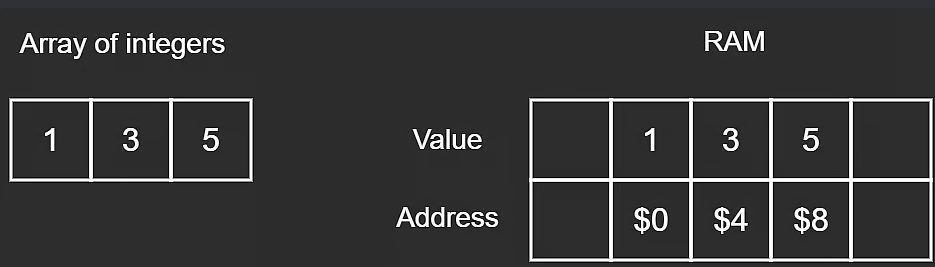

# RAM

Random Access Memory

Stores values at certain addresses

## Address

- Stores a byte value
- 4 bytes apart
  - Since one int is 4 bytes

`0x00` beginning address in hex

## Bit

1's and 0's

## Byte

1 byte = 8 bits

## Hexadecimal

`0xA3`

1 hex = 4 bits

2 hex = 8 bits = 1 byte
| --- | --- | --- |
| Decimal | Hex | Binary |
| 0 | 0 | 0000 |
| 1 | 1 | 0001 |
| 2 | 2 | 0010 |
| 3 | 3 | 0011 |
| 4 | 4 | 0100 |
| 5 | 5 | 0101 |
| 6 | 6 | 0110 |
| 7 | 7 | 0111 |
| 8 | 8 | 1000 |
| 9 | 9 | 1001 |
| 10 | A | 1010 |
| 11 | B | 1011 |
| 12 | C | 1100 |
| 13 | D | 1101 |
| 14 | E | 1110 |
| 15 | F | 1111 |