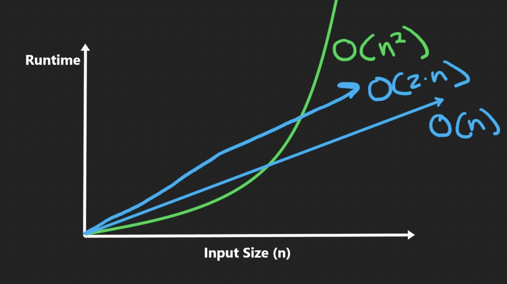

# Algorithms

## Resources

[Introduction-Algorithms-3rd-MIT-Press](https://www.amazon.com/Introduction-Algorithms-3rd-MIT-Press/dp/0262033844)

## Complexity

### Time Complexity

The time of execution

#### Ranking

| --- | --- |
| BEST | |
| O(1) | Think constant time, it's time is not dependent on input size|
| O(logn) |  |
| O(n) | Think linear, grows the same as the input grows |
| O(nlogn) |  |
| O(n^2) | Think of a square, for every n you have a n |
| O(a^n) | Think of binary tree 2^n where a node is given 2 options n times |
| O(n!) | Think exponential |
--WORST--

#### Calculate

Remove the constants used in addition, subtraction, and multiplication
- We dont care about constants because constants only matter at smaller inputs which are insignificant to our CPU.
  - If you mapped n^2 and 2n on a graph, 2n would be higher in runtime (y) only for smaller input (x). Eventually they would intersect and n^2 will always be bigger. See graph below.
  

Loops contributes the most to Time Complexity

```python
for i in range(n):
# Time Complexity = O(n)
```

Insignificant operations to Time Complexity include:
- Variable Declaration
  - `x = 0`
  - Time Complexity = O(1)
- Arithmetic
  - `x + 1`
  - Time Complexity = O(1)
- Return
  - `return x`
  - Time Complexity = O(1)

C++ Example
```c++
int listSum(A,n){          // A->array and n->number of elements in the array 
    total = 0              // cost=1  no of times=1 
    for(i=0; i<n; n--){    // cost=2  no of times=n+1 (+1 for the end false condition) 
        sum = sum + A[i]   // cost=2  no of times=n  
    }
    return sum             // cost=1  no of times=1 
}
/*
Tsum = function call + for statement + sum arithmetic + return 

function call = 1

for statement = 2 * loop + end false condition = 2*n + 1

sum arithmetic = 2 * loop = 2*n

return = 1

Tsum = 1 + 2*(n+1) + 2*n + 1 = 4n + 1 
     = C1 * n + C2
     = O(n)
*/
```

#### O(1)

Number of operations is constant relative to the input size.

USUALLY access is instant.

Not always fast, there could be 1000 operations and the time complexity could still be O(1). O(1) just means that it will only be 1000 operations regardless of the input size.

#### O(2n) 

Visualize
- 2 n's

| | | | | |
|---------|----------|---------|---------|---------|
| n | n | n | n | n |
| n | n | n | n | n | 

#### O(n^2)

Visualize
- n squared
- For every n is a n
- n n's

| n | = | 5 |  | |
|---------|----------|---------|---------|----------|
| n | n | n | n | n |
| n | n | n | n | n |
| n | n | n | n | n |
| n | n | n | n | n |
| n | n | n | n | n |

### Notations

O, Ω (Amortized) and Θ have nothing to do with worst, best and average case of algorithms. 

- Big O (O): Describes an upper bound on the time complexity
- Big Omega (Ω): Describes a lower bound on the time complexity
- Big Theta (Θ): Describes a tight bound on the time complexity
 
All three give us a way to express statements about the rate of growth of functions

For example, you can have a lower bound (Omega) on the worst-case time complexity of an algorithm. "The function that describes the worst-case behavior of this algorithm grows **at least** as quickly as the function O(n^2)".

#### Ω | Amortized

Average time per operation
- Used to ensure the average performance is acceptable, even if some individual operations might take longer

### Space Complexity

*Not as relevant as time complexity* 

#### Calculate

1. instruction space
amount of memory used to save the compiled version of instructions

2. environmental stack
a function y called inside of function x places
all of function x's variables onto the stack

3. Data space
Amount of space used by the variables and constants

- 1 byte
  - bool, char
- 2 bytes
  - short, unsigned short
- 4 bytes
  - int, float, long
- 8 bytes
  - double, long long
- string = amount of characters * 1 byte
- unsigned and signed added on prefix still keeps the same size

## Edge case checking

> Input = anything you are operating on to get output

- **If you have input, you have to validate it.**
  - Not empty
  - Correct type
  - Need to compare? Input needs > 1
- **Never make any assumptions about your input**
- Check both edges literally (beginning and end)

## Recursion

Turning a problem into sub-problems until a base case is reached and then solving the sub-problems to solve the more complex problem

recursive function = 
1. base case
2. recursive step: calling itself with smaller input

Useful to:
- work backwards
  - reversing
  - depth first search on trees
  - start at subproblems of problems
- break problems into sub problems

Tips:
- Just think of turning the problem into a subproblem one step at a time
- Return answer to the subproblem
  - or return what you want and change by reference
- Works like stacks, LIFO

Examples:
- Starting with the sub bullet point of a todo list

### Operations & Complexity

O(n) space and complexity

- The equivalent loop would just be O(n) space complexity and not O(n) space complexity

The O(n) space complexity comes from the method calls getting put into the call stack and if there are n method calls there are n methods in the call stack

### Top-Down

aka Divisive or Decrease and Conquer or Divide and Conquer

Traditional Recursion, break the problem down into subproblems all the way to the base case and use that to solve the previous problem all the way back up to the original problem.

#### Memoization

Top-down recursion often uses memoization to store the results of already solved subproblems to avoid redundant calculations by ensuring a function is only called once for each subproblem.

#### Example 
```python
memo = {}  # memoization
def fib_top_down(n):
  if n <= 1:
    return n
  if n not in memo:
    memo[n] = fib_top_down(n-1) + fib_top_down(n-2)
  return memo[n]
```

### Bottom-Up

[article](https://medium.com/cracking-the-coding-interview-in-ruby-python-and/bottom-up-and-top-down-recursion-explained-with-examples-in-ruby-javascript-and-python-mastering-9fa051ee53ff)
aka Aggregative or Dynamic Programming

Starts with the simplest subproblem (base case), then uses the subproblem to solve more complex subproblems all the way up to the original problem

#### Tabulation

Bottom-up recursion often uses tabulation to store the results of subproblems in a table (usually an array or a matrix) to ensure that each subproblem is only solve once.

#### Example

```python
def fib_bottom_up(n):
  if n <= 1:
    return n
  
  table = [0] * (n+1) # n+1 because we including 0
  table[1] = 1

  for i in range(2, n+1): # loop from 2 to n (0, 1 already handled)
    table[i] = table[i-1] + table[i-2] #this number is the result of the past 2 numbers
  
  return table[n]
```

#### Top-Down vs Bottom-up
[Link](https://medium.com/cracking-the-coding-interview-in-ruby-python-and/bottom-up-and-top-down-recursion-explained-with-examples-in-ruby-javascript-and-python-mastering-9fa051ee53ff)

Top-Down if:
- problem naturally breaks down into subproblems
- easier to conceptualize and implement for problems with a hierarchical or recursive structure
- Divide and Conquer

Bottom-up if:
- problem has a lot of overlapping subproblems
- useful when you know the base case
- Dynamic Programming

Top-down is easier to implement, but bottom-up is more efficient in time complexity (unless memoization is used for top-down) and in space complexity (tabulation is handled better in memory vs a call-stack can result in stack overflow)

## Other Algorithms

### Diff algorithms

[Wagner Fisher Algorithm](http://wiki.c2.com/?WagnerFisherAlgorithm)

## Shifting

Start at the beginning of the direction you are shifting
- Shifting everything to the left? Start at the left side
- Shifting everything to the right? Start at the right side

## Two-Pointer / In-place algorithm

Algorithm that doesnt require extra space proportional to the input size.

i.e. dont create another array for storing values, just edit the existing array

1) Keep a Left pointer and a Right pointer
2) Update `R` w/ O(n) loop
   `for R in range(len(myList))`
3) Move the data at `R` to `L` when condition is met
   `if(myList[L] != myList[R])`

## Get min

If data is sorted, getting min is O(1).

### Static data

If the input is not changing, you can just get the minimum.

### Dynamic data

Use a minimum state data structure. Keep track of the minimum state at every entry of input, so that you dont have to find the minimum every time the data changes.

## Combine Linked Lists

<mark> DONT THINK OF LINKED LIST AS ARRAY</mark>

**Once one list runs out**, just set the end to the list with stuff still in it

## Queue

### Queue Simulation

Replace simulation with counting or another mathematical approach

Keep track of the data separate from the queue as a count or separate data structure

Patterns to Recognize:
- queue simulation
- Circular queue problem
- greedy decisions (serve an item to someone only if it matches their preference)

Optimal Solution:
1. Count the number of elements and count their uniqueness / organize into separate data structure(s)
2. Traverse the count or separate data structure(s)

## Simulate DS with another DS

Remember the core principles of the ds 

Examples:
- LIFO
- FIFO
- instant access
- O(1) insert at ends
- O(1) insert in middle

## Recursion

### Factorial

> `5! = 5 * 4 * 3 * 2 * 1`

A useful way of thinking of factorial sequence is that `5! = 5 * 4!`
- do you see how recursion can be used here? just keep calling the same function with the value `-1`

```python
def factorial(num: int) -> int:
    if num == 1:
        return 1
    return num * factorial(num-1)
```

### Fibonacci

```python
from functools import cache

@cache  # memoization - it will cache the results of the function calls so that if the function is called again with the same input it will just return from the cache
def fibonacci(n):
  if n <= 1:
    return n
  return fibonacci(n-1) + fibonacci(n-2)
```

#### Get time complexity 

O(2^n) - Geometric series, i.e. each term is all the numbers before it multiplied by the common ratio

This example can help you understand how to get time complexity of a binary tree.


1) 1st level is 1 node, 2nd level is 2 nodes, 3rd level there is 4 nodes.
2) The pattern is the number of nodes is 2x / **doubles** the previous level
3) Double at each level means multiple by 2 at each level which means **2^n**

### Reverse Linked List

1. Go to the tail of the linked list and start returning to the previous nodes
2. When returning to the previous nodes, always return the og tail
3. Just update the current node in that specific call to point backwards
- `head.next.next = head`

```python3
# Definition for singly-linked list.
# class ListNode:
#     def __init__(self, val=0, next=None):
#         self.val = val
#         self.next = next

# Recursive Solution
class Solution:
    def reverseList(self, head: Optional[ListNode]) -> Optional[ListNode]:
        # List could be empty, make it base case
        if head is None:
            return None
        # create a variable for the head of this linked list
        newHead = head
        # If there is > 1 node turn it into a sub-problem to sort
        if head.next:
            # change the head to the new head of the reverse linked list
            newHead = self.reverseList(head.next)
            # reverse this node
            head.next.next = head
            head.next = None
        return newHead
```
