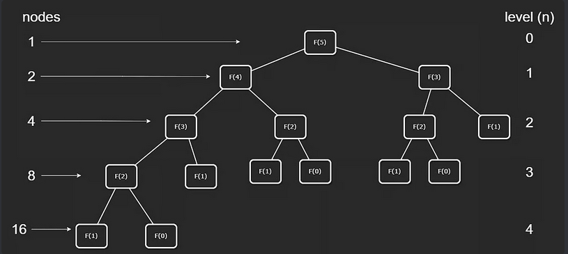

# Leetcode

Neetcode:

- Static Arrays
  - [26. Remove Duplicates from Sorted Array](https://leetcode.com/problems/remove-duplicates-from-sorted-array/)
  - [27. Remove Element](https://leetcode.com/problems/remove-element/)
- Dynamic Arrays
  - [1929. Concatenation of Array](https://neetcode.io/courses/dsa-for-beginners/3)
- Stacks
  - [20. Valid Parentheses](https://leetcode.com/problems/valid-parentheses/description/)
  - [155. Min Stack](https://leetcode.com/problems/min-stack/description/)
- Singly Linked Lists
  - [206. Reverse Linked List](https://leetcode.com/problems/reverse-linked-list/description/)
  - [21. Merge Two Sorted Lists](https://leetcode.com/problems/merge-two-sorted-lists/description/)
- Doubly Linked Lists
  - [707. Design Linked List](https://leetcode.com/problems/design-linked-list/description/)
  - [1472. Design Browser History](https://leetcode.com/problems/design-browser-history/description/)
- Queues
  - [1700. Number of Students Unable to Eat Lunch](https://leetcode.com/problems/number-of-students-unable-to-eat-lunch/description/)
  - [225. Implement Stack using Queues](https://leetcode.com/problems/implement-stack-using-queues/description/)
- One-Branch Recursion | Factorial
  - [206. Reverse Linked List](https://leetcode.com/problems/reverse-linked-list/description/)
- Two-Branch Recursion | Fibonacci Sequence
  - [70. Climbing Stairs](https://leetcode.com/problems/climbing-stairs/description/)
- Insertion Sort
- Merge Sort
  - [23. Merge k Sorted Lists](https://leetcode.com/problems/merge-k-sorted-lists/description/)
- Quick Sort
  - [75. Sort Colors](https://leetcode.com/problems/sort-colors/description/)
- Bucket Sort
- Binary Search | Search Array
  - [704. Binary Search](https://leetcode.com/problems/binary-search/description/)
  - [74. Search a 2D Matrix](https://leetcode.com/problems/search-a-2d-matrix/description/)
- Binary Search | Search Range
  - [374. Guess Number Higher or Lower](https://leetcode.com/problems/guess-number-higher-or-lower/description/)
  - [278. First Bad Version](https://leetcode.com/problems/first-bad-version/description/)
  - [875. Koko Eating Bananas](https://leetcode.com/problems/koko-eating-bananas/description/)
- Binary Tree
- Binary Search Tree
- BST Insert and Remove
- Depth-First Search
- Breadth-First Search
- BST Sets and Maps
- Backtracking | Tree Maze
- Heap / Priority Queue | Heap Properties
- Heap / Priority Queue | Push and Pop
- Heap / Priority Queue | Heapify
- Hashing | Hash Usage
- Hashing | Hash Implementation
- Graphs | Intro to Graphs
- Matrix DFS
- Matrix BFS
- Adjacency List
- 1-Dimension DP
- 2-Dimension DP
- Bit Operations

## Shifting

Start at the beginning of the direction you are shifting
- Shifting everything to the left? Start at the left side
- Shifting everything to the right? Start at the right side

## Two-Pointer / In-place algorithm

Algorithm that doesnt require extra space proportional to the input size.

i.e. dont create another array for storing values, just edit the existing array

1) Keep a Left pointer and a Right pointer
2) Update `R` w/ O(n) loop
   `for R in range(len(myList))`
3) Move the data at `R` to `L` when condition is met
   `if(myList[L] != myList[R])`

## Get min

If data is sorted, getting min is O(1).

### Static data

If the input is not changing, you can just get the minimum.

### Dynamic data

Use a minimum state data structure. Keep track of the minimum state at every entry of input, so that you dont have to find the minimum every time the data changes.

## Combine Linked Lists

<mark> DONT THINK OF LINKED LIST AS ARRAY</mark>

**Once one list runs out**, just set the end to the list with stuff still in it

## Queue

### Queue Simulation

Replace simulation with counting or another mathematical approach

Keep track of the data separate from the queue as a count or separate data structure

Patterns to Recognize:
- queue simulation
- Circular queue problem
- greedy decisions (serve an item to someone only if it matches their preference)

Optimal Solution:
1. Count the number of elements and count their uniqueness / organize into separate data structure(s)
2. Traverse the count or separate data structure(s)

## Simulate DS with another DS

Remember the core principles of the ds 

Examples:
- LIFO
- FIFO
- instant access
- O(1) insert at ends
- O(1) insert in middle

## Recursion

### Factorial

> `5! = 5 * 4 * 3 * 2 * 1`

A useful way of thinking of factorial sequence is that `5! = 5 * 4!`
- do you see how recursion can be used here? just keep calling the same function with the value `-1`

```python
def factorial(num: int) -> int:
    if num == 1:
        return 1
    return num * factorial(num-1)
```

### Fibonacci

```python
from functools import cache

@cache  # memoization - it will cache the results of the function calls so that if the function is called again with the same input it will just return from the cache
def fibonacci(n):
  if n <= 1:
    return n
  return fibonacci(n-1) + fibonacci(n-2)
```

#### Get time complexity 

O(2^n) - Geometric series, i.e. each term is all the numbers before it multiplied by the common ratio

This example can help you understand how to get time complexity of a binary tree.



1) 1st level is 1 node, 2nd level is 2 nodes, 3rd level there is 4 nodes.
2) The pattern is the number of nodes is 2x / **doubles** the previous level
3) Double at each level means multiple by 2 at each level which means **2^n**

### Reverse Linked List

1. Go to the tail of the linked list and start returning to the previous nodes
2. When returning to the previous nodes, always return the og tail
3. Just update the current node in that specific call to point backwards
- `head.next.next = head`

```python3
# Definition for singly-linked list.
# class ListNode:
#     def __init__(self, val=0, next=None):
#         self.val = val
#         self.next = next

# Recursive Solution
class Solution:
    def reverseList(self, head: Optional[ListNode]) -> Optional[ListNode]:
        # List could be empty, make it base case
        if head is None:
            return None
        # create a variable for the head of this linked list
        newHead = head
        # If there is > 1 node turn it into a sub-problem to sort
        if head.next:
            # change the head to the new head of the reverse linked list
            newHead = self.reverseList(head.next)
            # reverse this node
            head.next.next = head
            head.next = None
        return newHead
```
