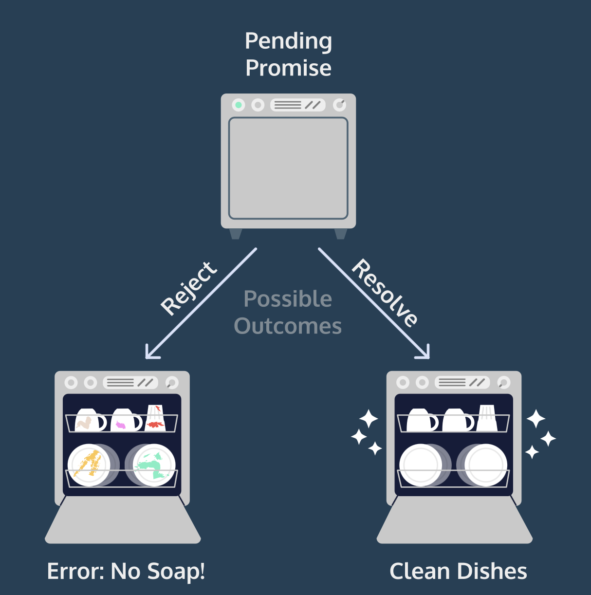

# Asynchronous JS Programming
[Cheatsheet](https://www.codecademy.com/learn/learn-intermediate-javascript/modules/javascript-promises/cheatsheet)

## Event Loop

JS uses an [event loop](https://www.youtube.com/watch?v=8aGhZQkoFbQ&feature=youtu.be) to execute other tasks while it awaits other async tasks to complete

## setTimeout

Schedule a function to be executed after a delay

```js
// browser
let myTimeout = setTimeout(function() {}, millisecondDelay, argumentForFunction);
// node
let myTimeOut = setTimeout( () => {}, millisecondDelay);
```

### Cancel setTimeout

Stop setTimeout from ever running
```js
// myTimeout = setTimeout(() => {console.log('this wont run');}, 5000);
clearTimeout(myTimeout)
```

## Promise

Async operation object that "Promises" to settle
- ES6 method of handling asynchronous actions

```js
const executorFunction = (resolve, reject) => {
   // start of async operation
    if(someCondition)
        resolve('I resolved');
    else
        reject('I reject');
}
const myPromise = new Promise(executorFunction);
```

JS passes in its own resolve and reject functions
- `resolve(resolvedValue)`
- `reject(reasonOrError)`
- function called to 
  - change the state of the Promise
  - return resolved value / error

### States



3 states:
1. Pending
   - in progress
2. Fulfilled
   - success
   - returned **resolved value**
3. Rejected
   - failed
   - returned reason (usually `Error`)

If not in a Pending state then it has been *settled*

### Then

Action executed after a Promise settles
- Always uses the first parameter as the resolved handler and the second parameter for the rejected handler
- It creates and returns a new promise

```js
myPromise.then(handleResolved, handleRejected)
//or
myPromise
   .then(handleResolved)
   .then(null, handleRejected)
```

### Catch

Accomplishes the same thing as a second then, handles rejected state
- just used for separation and readability 

```js
prom
 .then((resolvedValue) => {
   console.log(resolvedValue);
 })
 .catch((rejectionReason) => {
   console.log(rejectionReason);
 });
```

### Composition | Chaining Promises

When an operation depends on a Promise (async operation), return a Promise in the success handler so it can wait for the first Promise to successfully settle.
- replaces the default new Promise return
- dont nest promises
- dont forget to return a promise inside the then

```js
firstPromiseFunction()
.then((firstResolveVal) => {  // success handler
  return secondPromiseFunction(firstResolveVal);
}) // handling second promise
.then((secondResolveVal) => { // success handler
  console.log(secondResolveVal);
});
```

### Concurrency | Run Multiple at Same Time

Multiple async operations happening together as one Promise
- if all Promises resolve, returns array containing resolve value from each promise
- if a single Promise rejects, immediately rejects `Promise.all()`

```js
Promise.all(arrayOfPromises); // returns single let 

let myPromises = Promise.all([returnsPromOne(), returnsPromTwo(), returnsPromThree()]);

myPromises
  .then((arrayOfValues) => {
    console.log(arrayOfValues);
  })
  .catch((rejectionReason) => {
    console.log(rejectionReason);
  });
```

## Async/Await

ES8's method for async actions
- "syntactic sugar" for using promises and [generators](https://developer.mozilla.org/en-US/docs/Web/JavaScript/Reference/Global_Objects/Generator)
- always returns a Promise
  - allows us to use `.then()` and `.catch()`

```js
// Function Expression 
// const myFunc = async() => {};

// Function Declaration
async function myFunc() {
   let resolvedValue = await myPromiseFirst(); // returns resolved value of Promise

   let resolvedValue = await myPromiseSecond(resolvedValue);

   // 1. Nothing returned, returns Promise.resolve(undefined)
   // 2. Non-Promise value returned, returns Promise.resolve(Non-Promise value)
   // 3. Promise returned
}

myFunc()
```

### Await

Returns Promise resolved value
- Stops the async function until its finished
  - async function still async with the rest of the JS application

### Error Handling

use `try...catch` or `Promise.catch()`

```js
async function usingTryCatch() {
 try {
   let resolveValue = await asyncFunction('thing that will fail');
 } catch (err) {
   // Catches any errors in the try block
   console.log(err);
 }
}

async function usingPromiseCatch() {
   let resolveValue = await asyncFunction('thing that will fail');
}
let rejectedPromise = usingPromiseCatch()
   .catch((rejectReason) => {
      console.log(rejectReason);
   })
;
// ^ this method is sometimes used in the global scope to catch final errors
```

### Concurrency | Multiple Promises

Create Promises without await, then await each of their resolutions
- if each Promise is truly independent and parallelism is needed,
  - must use individual `.then()` functions
  - or use `await Promise.all()`

```js
async function concurrent() {
   const firstPromise = firstAsyncThing();
   const secondPromise = secondAsyncThing();
   console.log(await firstPromise, await secondPromise); // async func halts at first await, but both promises started

   // true concurrency
   let resolvedArray = await Promise.all([firstPromise, secondPromise]);
}
```