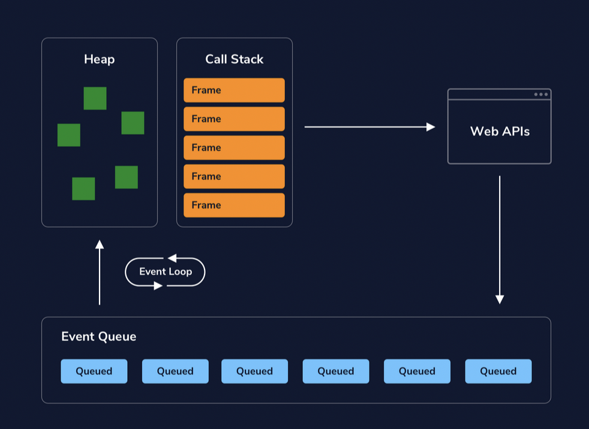

# Asynchronous JS Programming
[Cheatsheet](https://www.codecademy.com/learn/learn-intermediate-javascript/modules/javascript-promises/cheatsheet)

## setTimeout

Schedule a function to be executed after a delay

```js
// browser
let myTimeout = setTimeout(function() {}, millisecondDelay, argumentForFunction);
// node
let myTimeOut = setTimeout( () => {}, millisecondDelay);
```

### Cancel setTimeout

Stop setTimeout from ever running
```js
myTimeout = setTimeout(() => {console.log('this wont run');}, 5000);
clearTimeout(myTimeout);
```

## Promise

Async operation object that "Promises" to settle
- ES6 method for handling asynchronous actions

```js
const myPromise = new Promise((resolve, reject) => {
   // start of async operation
    if(someCondition)
        resolve('I resolved');
    else
        reject('I reject');
});
```

JS passes in its own resolve and reject functions
- `resolve(resolvedValue)`
- `reject(reasonOrError)`
- function called to 
  - change the state of the Promise
  - return resolved value / error

### States


3 states:
1. Pending
   - in progress
2. Fulfilled
   - success
   - returned **resolved value**
3. Rejected
   - failed
   - returned reason (usually `Error`)

If not in a Pending state then it has been *settled*

### Then | Success Handler

Action executed after a Promise settles
- first parameter is the resolved handler
- second parameter is the rejected handler
- Returns a new promise

```js
myPromise.then(handleResolved, handleRejected)
//or
myPromise
   .then(handleResolved)
   .then(null, handleRejected)
```

### Catch | Reject Handler

Accomplishes the same thing as a second parameter in then, handles rejected state
- just used for separation and readability 

```js
prom
 .then((resolvedValue) => {
   console.log(resolvedValue);
 })
 .catch((rejectionReason) => {
   console.log(rejectionReason);
 });
```

### Composition | Chaining Promises

When an operation depends on a Promise (async operation), **return a Promise in the success handler** so it can wait for the first Promise to successfully settle.
- replaces the default new Promise return
- dont nest promises
- dont forget to return a promise inside the then

```js
firstPromiseFunction()
.then((firstResolveVal) => {
  return secondPromiseFunction(firstResolveVal);
}) // handling second promise
.then((secondResolveVal) => {
  console.log(secondResolveVal);
});
```

### Concurrency | Run Multiple at Same Time

Multiple async operations happening together as one Promise
- if all Promises resolve, returns array containing resolve value from each promise
- if a single Promise rejects, immediately rejects `Promise.all()`

```js
let myPromises = Promise.all([returnsPromOne(), returnsPromTwo(), returnsPromThree()]);

myPromises
  .then((arrayOfValues) => {
    console.log(arrayOfValues);
  })
  .catch((rejectionReason) => {
    console.log(rejectionReason);
  });
```

## Async/Await

ES8's method for async actions
- "syntactic sugar" for using promises and [generators](https://developer.mozilla.org/en-US/docs/Web/JavaScript/Reference/Global_Objects/Generator)
- always returns a Promise
  - allows us to use `.then()` and `.catch()`

```js
// Function Expression 
// const myFunc = async() => {};

// Function Declaration
async function myFunc() {
  let resolvedValue x= await myPromiseFirst(); // returns resolved value of Promise

  //Composition (by waiting for the first promise and using resolved value)
  let resolvedValue = await myPromiseSecond(resolvedValue);

  // Return
  // 1. Nothing returned, returns Promise.resolve(undefined)
  // 2. Non-Promise value returned, returns Promise.resolve(Non-Promise value)
  // 3. Promise returned
}

myFunc()
```

### Await

Returns Promise resolved value
- Stops the async function until its finished
- async function still async with the rest of the JS application

### Error Handling

use `try...catch` or `Promise.catch()`

```js
async function usingTryCatch() {
 try {
   let resolveValue = await asyncFunction('thing that will fail');
 } catch (err) {
   // Catches any errors in the try block
   console.log(err);
 }
}

async function usingPromiseCatch() {
   let resolveValue = await asyncFunction('thing that will fail');
}
let rejectedPromise = usingPromiseCatch()
   .catch((rejectReason) => {
      console.log(rejectReason);
   })
;
// ^ this method is sometimes used in the global scope to catch final errors
```

### Concurrency | Multiple Promises

Create Promises without await, then await each of their resolutions

if each Promise is truly independent and parallelism is needed,
- must use individual `.then()` functions
- or use `await Promise.all()`

```js
async function concurrent() {
  // start at same time
  const firstPromise = firstAsyncThing();
  const secondPromise = secondAsyncThing();
  console.log(await firstPromise, await secondPromise); // async func halts at first await, but both promises started

   // true concurrency
   let resolvedArray = await Promise.all([firstPromise, secondPromise]);
}
```

## Event Loop

JS is single-threaded, so it cant run true concurrency.

True concurrency is usually when two or more procedures are executed at the same time on the same shared resources (threads, processes, cpu cores).

JS emulates concurrency with the [event loop](https://www.youtube.com/watch?v=8aGhZQkoFbQ&feature=youtu.be).

The Event Loop allows other tasks to execute while it waits for other async tasks to complete. It does this checking periodically if the call stack is cleared to move any messages in the Event Queue to the stack.

JS will always execute synchronously from the call stack, but asynchronous code can be pushed to web APIs event queues and directed back to the call stack using an event loop.



### Memory Heap

Block of unordered memory used to store program data (variables and objects)

### Call Stack

Tracks what function is currently being run / current execution context by keeping it at the top of the stack

1. Invoke a function
2. Frame created to connect arguments and local variables from the heap
3. Frame added to call stack
   - Each frame has a function execution context which contains the function's lexical and variable environment
4. When a function runs to completion, it's popped off the call stack, clearing it from memory

ex)
```js
function foo() {
 return function bar() {
   return function baz() {
     return 'I love CodeCademy'
   }
 }
}
console.log(foo()()());

/*
Call Stack
-------------------------
| baz()                 | <- Top
| bar()                 |
| foo()                 |
| console.log(function) |
| global()              |
-------------------------
*/
```

### Event Queue

List of messages corresponding to functions waiting to be processed and added back to the stack

Functions come from
- web APIs
- async functions

Once the call stack is empty, the event loop adds an event queue one at a time

### Example

```js
console.log("This is the first line of code in app.js.");

function usingsetTimeout() {
    console.log("I'm going to be queued in the Event Loop.");
}
setTimeout(usingsetTimeout, 3000);

console.log("This is the last line of code in app.js.");
```

1. first console.log added to the stack, executed then pops off the stack
2. setTimeout() added to the stack, the callback is passed to the web API, after 3 seconds usingsetTimeout() pushed to Event Queue
3. last console.log added to the stack, executes, pops off stack
4. stack empty, event loop pushes usingsetTimeout onto the stack
5. inside usingsetTimeout console.log is added tot he stack, executes, pops off stack
6. usingsetTimeout popped off stack

### Node or Web APIs