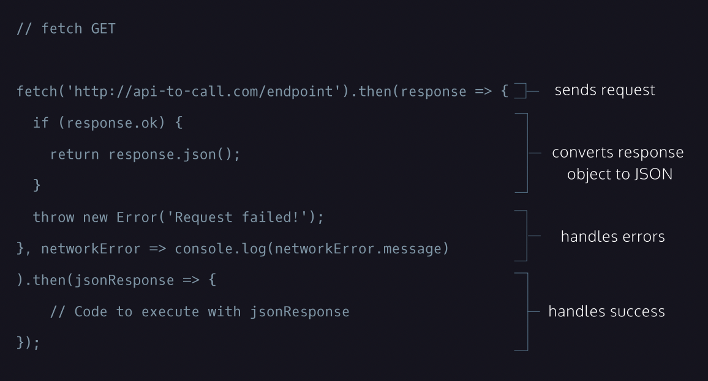

# Fetch

Make requests using `fetch()` in JS

`fetch(url, objectConfig)`

1. Call `fetch()` with endpoint URL as first argument
   1. Makes request object w/ info for API
   2. Sends the request object to the API endpoint
   3. Returns Promise that resolves a response object
      - contains status of Promise
      - contains info the API sent back
2. Chain `.then()` with urlResponded() & networkError() arguments (handleResolve() & handleReject())
   - urlResponded()
      1. response object argument (resolved value from fetch())
      2. if response ok, return response as JSON
      3. if response not ok, throw error
   - networkError() w/ error argument
3. Chain 2nd `.then()` with jsonResponse() (handleResolve())
   - jsonResponse() w/ jsonResponse argument (resolved value from previous .then())

## Fetch Config

- `method: 'POST'`
- `body: JSON.stringify({id: '200'})`

